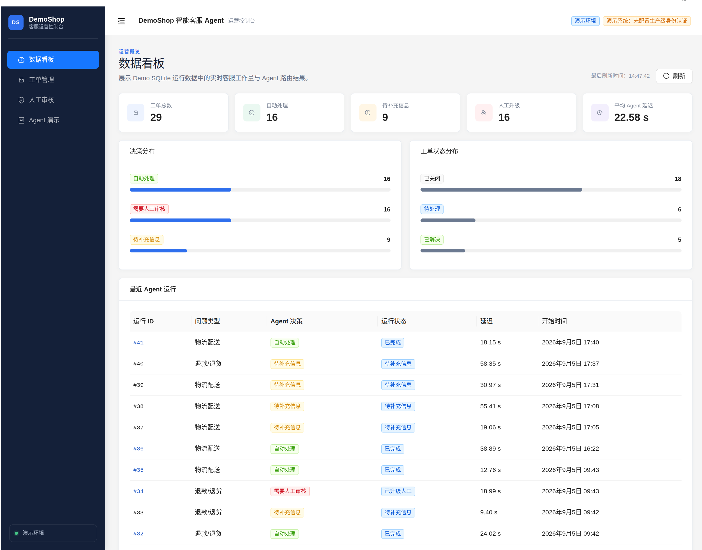
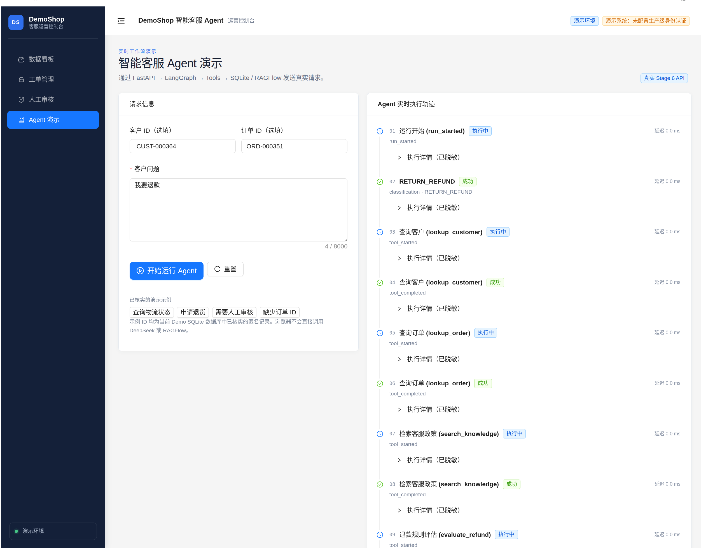
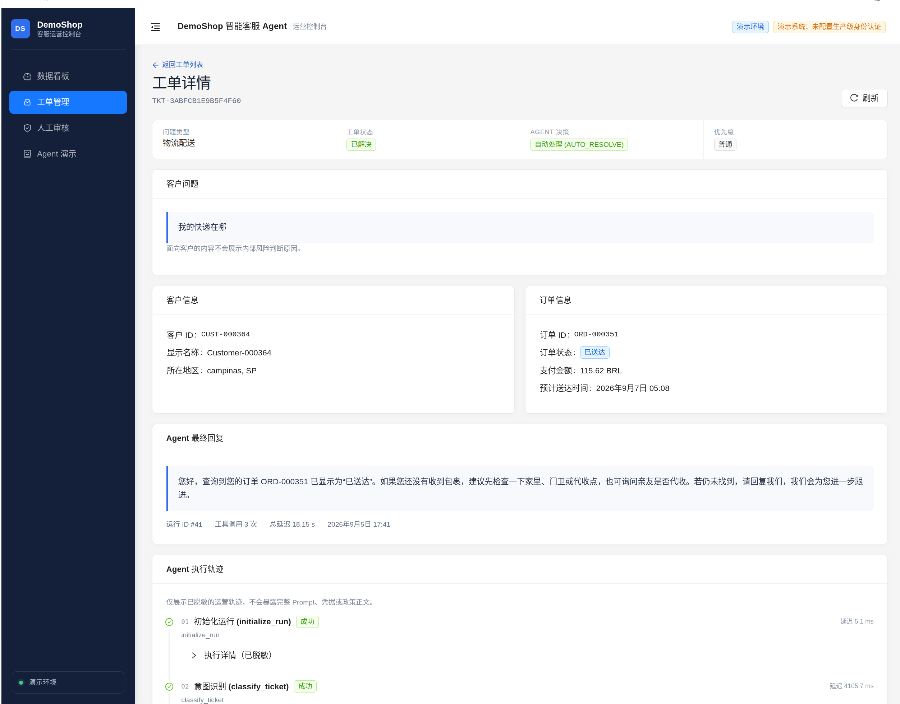
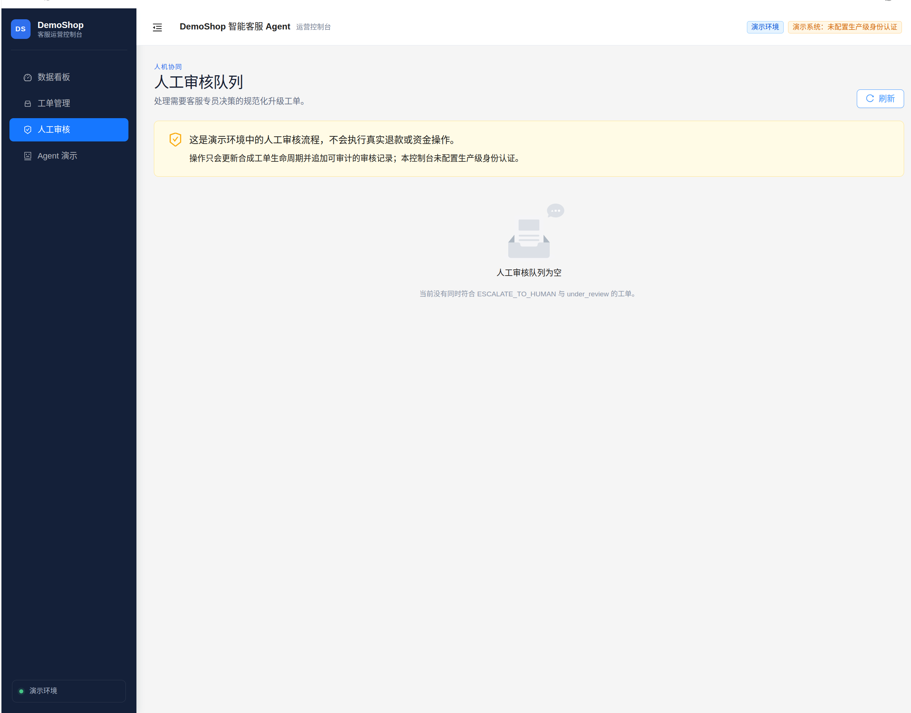
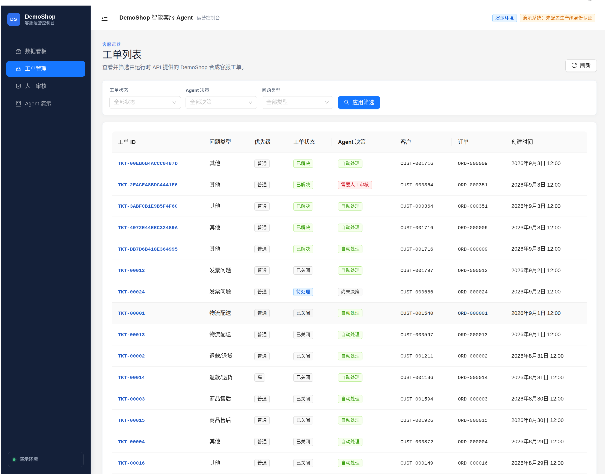
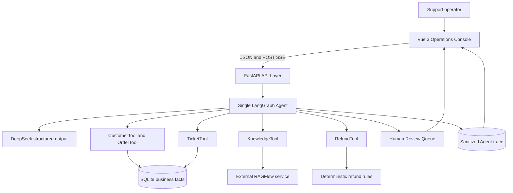
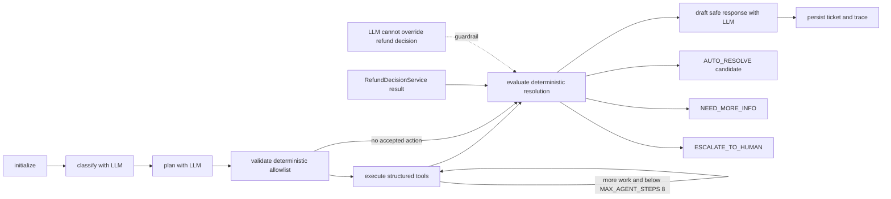

# DemoShop Customer Support Agent

A guarded customer-support Agent built with LangGraph, DeepSeek, RAGFlow, FastAPI, and Vue 3, combining real anonymized ecommerce facts, retrieval-backed policies, and deterministic business controls.

DemoShop is a portfolio simulation—not an Olist or JD.com internal system. The application demonstrates how an LLM can understand and explain a support request while deterministic code retains control of tools, refund candidacy, escalation, and persistence.

## Project Overview

This repository implements a complete local customer-support workflow: a Vue operations console submits tickets to FastAPI, receives live POST-SSE execution events, and displays the resulting decision and sanitized trace. A single LangGraph Agent uses DeepSeek for structured language tasks, retrieves policy evidence from an external RAGFlow service, reads business facts from SQLite, and routes sensitive cases to a human-review queue.

The system never executes a financial refund. `AUTO_RESOLVE` means only that the request is a rule-qualified demo candidate that can be handled without human escalation.

## Demo Screenshots

All screenshots below were captured from the real local Vue operations console using anonymous Demo identifiers. They are not generated mockups.

### Operations Dashboard

[](docs/assets/screenshots/01_dashboard.png)

### Live Agent execution

[](docs/assets/screenshots/02_agent_demo.png)

The capture shows an in-progress POST-SSE run so the started/completed tool events remain visible as they arrive.

### Ticket investigation and trace

[](docs/assets/screenshots/03_ticket_trace.png)

### Human review and Ticket inbox

| Human-review empty state | Filterable Ticket inbox |
|---|---|
| [](docs/assets/screenshots/04_human_review.png) | [](docs/assets/screenshots/05_ticket_inbox.png) |

## Key Features

- Stateful single-Agent customer-support workflow built with LangGraph.
- DeepSeek structured classification, allowlisted planning, and safe response drafting.
- Guarded structured-tool orchestration with deterministic plan validation and an eight-call bound.
- Deterministic `RefundDecisionService` for policy eligibility and simulated operational controls.
- Retrieval-only RAGFlow integration over a ten-document policy corpus.
- SQLite fact layer preserving customers, orders, items, payments, reviews, tickets, and traces.
- Human-in-the-loop escalation queue with controlled demo review actions.
- Typed FastAPI endpoints, consistent error envelopes, request IDs, and POST-SSE streaming.
- Persisted, ordered, sanitized Agent execution traces.
- Vue 3 operations console for dashboard, tickets, trace review, human review, and live Agent demos.
- Reproducible 60-case regression benchmark plus an untouched 24-case post-fix holdout.

## System Architecture



RAGFlow is an external dependency and is not repackaged by this repository. DeepSeek and RAGFlow credentials remain server-side; the browser calls only FastAPI.

## Agent Workflow



The LLM proposes structured outputs; it does not receive authority to execute SQL, mutate balances, invent tools, or override the deterministic refund result.

## Why a Guarded Agent Instead of Pure ReAct

A free-form ReAct loop is flexible, but customer-support decisions often depend on exact data, policy boundaries, and auditable safety controls. This design separates responsibilities:

| LLM responsibility | Deterministic responsibility |
|---|---|
| Classify natural-language intent | Validate canonical taxonomy and identifiers |
| Propose allowlisted actions | Add required tools and reject unrelated tools |
| Summarize the issue | Retrieve exact SQLite business facts |
| Draft customer-safe wording | Calculate refund eligibility and escalation |
| Explain the final route | Bound steps, persist lifecycle, and sanitize traces |

This makes model behavior observable without treating model prose as a business transaction.

## Evaluation Results

All figures below come from controlled portfolio benchmarks. They are not production traffic, an industry benchmark, or a production SLA.

### Development / Regression Benchmark

The main benchmark contains 60 Chinese cases across six intents. Its decision distribution is 31 `AUTO_RESOLVE`, 15 `NEED_MORE_INFO`, and 14 `ESCALATE_TO_HUMAN`.

| Result | Task Success | Decision Accuracy | Escalation Recall |
|---|---:|---:|---:|
| `OFFICIAL_RUN_1` | 51/60 (85.00%) | 85.00% | 42.86% |
| `OFFICIAL_RUN_2` regression | 60/60 (100.00%) | 100.00% | 100.00% |

Run 1 was used for failure analysis and led to generalizable implementation fixes. The final 60/60 run is therefore a regression result, not an untouched generalization score. Both runs and the unchanged benchmark SHA256 are preserved.

### Post-fix Untouched Holdout

The holdout contains 24 completely new Chinese cases created after the fixes. It was frozen, run exactly once, and followed by no system or ground-truth tuning.

| Metric | `HOLDOUT_RUN_1` |
|---|---:|
| Intent Accuracy | 100.00% |
| Decision Accuracy | 95.83% |
| Task Success | 23/24 (95.83%) |
| Tool Selection F1 | 100.00% |
| Exact Tool Set Accuracy | 100.00% |
| Escalation Precision / Recall / F1 | 100.00% / 83.33% / 90.91% |
| System Error Rate | 0.00% |
| Latency P50 / P95 | 19.74 s / 40.09 s |

The missed escalation, `HOLD-REF-003`, returned `NEED_MORE_INFO` rather than unsafe automatic resolution. A missing refund-reason extraction caused the deterministic service to request more information before reaching the high-amount escalation control. This failure remains visible and was not tuned or rerun.

## Safety and Human-in-the-loop

- Refund decisions are computed by deterministic rules loaded from one canonical YAML source.
- Risk, inactive-account, identity, amount, frequency, and source-quality controls can require human review.
- Missing identifiers and required evidence route to `NEED_MORE_INFO`.
- Legal, explicit-human-review, and personal-safety signals route to a neutral human-review outcome.
- Customer-facing text cannot expose internal risk flags or claim an unexecuted refund succeeded.
- Tool names and arguments use typed Pydantic contracts; non-allowlisted actions are discarded.
- Agent runs and node steps are stored with safe summaries rather than full prompts or credentials.
- Human-review actions change only the synthetic demo ticket lifecycle and never call a payment provider.

## Data and Policy Provenance

| Layer | Source | Used for |
|---|---|---|
| **Real / anonymized transactional data** | Olist Brazilian E-Commerce Public Dataset | Customer/order relationships, items, products, sellers, payments, reviews, and source timestamps |
| **Public-policy-derived** | Public ecommerce help-center pages, reorganized and paraphrased | Return, after-sales, delivery, invoice, refund, and account guidance |
| **Simulated internal** | Deterministic DemoShop generation and canonical rules | Membership, risk, identity verification, tickets, refund approvals, SLA, and escalation controls |

Demo identifiers and time normalization are deterministic derivatives. DemoShop does not claim that Olist transactions were governed by JD.com policies, and it is not a real internal system of either organization.

Raw Olist CSV files are never committed or redistributed. Download the dataset from the official [Olist Brazilian E-Commerce Public Dataset page](https://www.kaggle.com/datasets/olistbr/brazilian-ecommerce), review its current terms, and place the files locally before building the demo data.

## Tech Stack

- Python 3.10+, FastAPI, Uvicorn, Pydantic, SQLAlchemy, and SQLite
- LangGraph, LangChain structured tools, and LangChain OpenAI-compatible adapter
- DeepSeek structured generation and external RAGFlow retrieval
- Vue 3, TypeScript, Vite, Vue Router, and Ant Design Vue
- pytest, Vitest, Vue Test Utils, Docker, Nginx, and Docker Compose

## Quick Start

The following flow is intentionally explicit. A fresh clone still requires the official Olist files, an available RAGFlow instance, and user-owned API credentials.

### 1. Clone and create the Python environment

```bash
git clone git@github.com:lws6200123/customer-support-agent.git
cd customer-support-agent
python3 -m venv .venv
env -u PYTHONPATH .venv/bin/python -m pip install --upgrade pip
env -u PYTHONPATH .venv/bin/python -m pip install -e ".[data,knowledge,dev]"
```

Python 3.10 or newer is required. The current frontend toolchain requires a Node version accepted by both installed engines; Node 22.12+ or Node 24 is the practical choice.

### 2. Obtain the Olist data

Download `olistbr/brazilian-ecommerce` manually from Kaggle and place these immutable files in `data/raw/olist/`:

```text
olist_customers_dataset.csv
olist_geolocation_dataset.csv
olist_order_items_dataset.csv
olist_order_payments_dataset.csv
olist_order_reviews_dataset.csv
olist_orders_dataset.csv
olist_products_dataset.csv
olist_sellers_dataset.csv
product_category_name_translation.csv
```

Do not add the CSV files or Kaggle credentials to Git.

### 3. Build deterministic demo data and initialize SQLite

```bash
env -u PYTHONPATH .venv/bin/python scripts/build_demo_dataset.py
env -u PYTHONPATH .venv/bin/python scripts/init_db.py
```

The build selects 2,000 scenario-aware orders with a fixed seed and clock, writes ignored processed CSVs, and creates the ignored runtime database at `data/seed/customer_support_demo.db`.

### 4. Prepare RAGFlow

Run RAGFlow separately using its official deployment instructions. In the RAGFlow UI:

1. Create one dataset for DemoShop customer-support policies.
2. Upload all ten Markdown files from `knowledge/policies/`.
3. Parse every document and confirm all ten are available for retrieval.
4. Create or select an API key and copy the dataset ID for local configuration.

The tested integration used RAGFlow v0.27.1 and the retrieval endpoint `POST /api/v1/retrieval`. Other versions may require compatibility verification.

### 5. Configure backend and frontend environments

```bash
cp .env.example .env
cp frontend/.env.example frontend/.env
```

Fill the backend `.env` with user-owned values:

- `DEEPSEEK_API_KEY`, `DEEPSEEK_BASE_URL`, `DEEPSEEK_MODEL`
- `RAGFLOW_BASE_URL`, `RAGFLOW_API_KEY`, `RAGFLOW_DATASET_ID`

The frontend exposes only `VITE_API_BASE_URL`; never place DeepSeek or RAGFlow credentials in a `VITE_*` variable.

### 6. Validate setup

```bash
env -u PYTHONPATH .venv/bin/python scripts/check_demo_setup.py
# or
make check
```

The check is read-only and prints only `PASS` or `MISSING` with non-secret details.

### 7. Start the application

Terminal 1:

```bash
make backend
```

Terminal 2:

```bash
cd frontend
npm ci
npm run dev
```

Open [http://localhost:5173](http://localhost:5173). FastAPI runs at [http://127.0.0.1:8000](http://127.0.0.1:8000), with interactive docs at `/docs` in development.

## Optional Docker Demo

Docker packages only the FastAPI application and Vue/Nginx frontend. RAGFlow remains an externally managed service, and the demo SQLite database is mounted from the host.

Complete Quick Start steps 1–5 first, including building `data/seed/customer_support_demo.db`. If RAGFlow runs on the Docker host, keep the safe default `CSA_DOCKER_RAGFLOW_BASE_URL=http://host.docker.internal:9380`; otherwise set it to a container-reachable RAGFlow URL.

```bash
docker compose -f docker-compose.demo.yml up --build
```

Then open [http://localhost:8080](http://localhost:8080). Nginx provides Vue history fallback and proxies `/api/` to FastAPI. The POST-SSE route has proxy buffering and caching disabled.

The host ports default to `8000` for the API and `8080` for the console. If either is occupied, set `CSA_API_PORT` and `CSA_FRONTEND_PORT` in `.env`; also make `CSA_DOCKER_FRONTEND_API_BASE_URL` match the public frontend origin used by the browser build.

This is not a one-command-from-zero environment: Olist acquisition, deterministic DB creation, RAGFlow setup, and private credentials remain explicit prerequisites.

## API and UI

Key API endpoints:

- `GET /health` and `GET /ready`
- `GET/POST /api/v1/tickets`
- `GET /api/v1/tickets/{ticket_id}`
- `POST /api/v1/agent/run`
- `POST /api/v1/agent/run/stream`
- `GET /api/v1/agent-runs/{run_id}` and `/steps`
- `GET/POST /api/v1/human-reviews`
- `GET /api/v1/dashboard/summary`

Console routes:

- `/` — live dashboard
- `/tickets` and `/tickets/:ticketId` — inbox and ticket detail
- `/human-reviews` — controlled review queue
- `/demo` — live Agent execution timeline

API responses use typed success/error envelopes and request IDs. POST-SSE emits safe lifecycle events without prompts, policy bodies, or credentials.

## Testing

The committed regression suites contain 77 backend tests and 17 frontend tests. Test counts describe software coverage, not model accuracy.

```bash
env -u PYTHONPATH .venv/bin/python -m pytest -q
cd frontend && npm test
cd frontend && npm run build
```

`make test` runs both test suites. Real DeepSeek/RAGFlow smoke and benchmark scripts are intentionally separate because they require external services and may incur API cost.

## Project Structure

```text
customer-support-agent/
├── src/customer_support_agent/   # Agent, API, tools, services, DB, LLM, core
├── frontend/                     # Vue 3 operations console
├── knowledge/                    # Canonical rules, provenance, 10 policies
├── data/
│   ├── raw/olist/                # ignored official source CSVs
│   ├── processed/                # ignored deterministic derived tables
│   ├── seed/                     # ignored demo runtime SQLite
│   └── evaluation/               # frozen cases and compact result artifacts
├── scripts/                      # build, audit, smoke, setup, evaluation
├── tests/                        # offline backend regression suite
├── reports/                      # concise evidence and analysis
├── docs/assets/screenshots/      # reviewed real UI captures only
├── docker/                       # API and frontend container definitions
├── docker-compose.demo.yml
├── Makefile
└── pyproject.toml
```

## Known Limitations

- The benchmark and holdout are small, controlled portfolio datasets—not independent or production evaluations.
- The 24-case holdout has one missed escalation that safely requested more information rather than auto-resolving.
- External-model latency was substantial: holdout P50 19.74 seconds and P95 40.09 seconds.
- RAGFlow must be deployed and populated separately; its lifecycle is outside this repository.
- The application has no production authentication, authorization, rate limiting, job queue, or high-availability design.
- SQLite and the desktop-focused UI are appropriate for a local demo, not concurrent enterprise traffic.
- Policy-derived content is illustrative and is not legal, tax, or operational advice.
- No payment provider is integrated, and no actual refund is executed.

## Detailed Reports

- [Stage 1 — Olist data audit](reports/stage1_olist_data_audit.md)
- [Stage 2 — Demo dataset](reports/stage2_demo_dataset.md)
- [Stage 2 — SQLite smoke](reports/stage2_sqlite_smoke.md)
- [Stage 3 — Policy audit](reports/stage3_policy_audit.md)
- [Stage 4 — Preflight audit](reports/stage4_preflight_audit.md)
- [Stage 4 — Knowledge retrieval smoke](reports/stage4_knowledge_smoke.md)
- [Stage 4 — Business tool smoke](reports/stage4_tool_smoke.md)
- [Stage 5 — Workflow design](reports/stage5_workflow_design.md)
- [Stage 5 — Agent smoke](reports/stage5_agent_smoke.md)
- [Stage 6 — API smoke](reports/stage6_api_smoke.md)
- [Stage 8A — Evaluation protocol](reports/stage8a_evaluation_protocol.md)
- [Stage 8A — Main benchmark](reports/stage8a_agent_benchmark.md)
- [Stage 8A — Failure analysis](reports/stage8a_failure_analysis.md)
- [Stage 8A — Fix log](reports/stage8a_fix_log.md)
- [Stage 8A — Holdout audit](reports/stage8a_holdout_audit.md)
- [Stage 8A — Post-fix holdout](reports/stage8a_holdout_report.md)

## Development History

Stages 0–7 established the project skeleton, Olist audit, deterministic demo database, policy corpus, business tools, guarded LangGraph workflow, FastAPI/SSE service, and Vue operations console. Stage 8A froze the regression benchmark and one-shot holdout. Stage 8B packages the existing implementation for reproducible portfolio review without changing Agent behavior.
