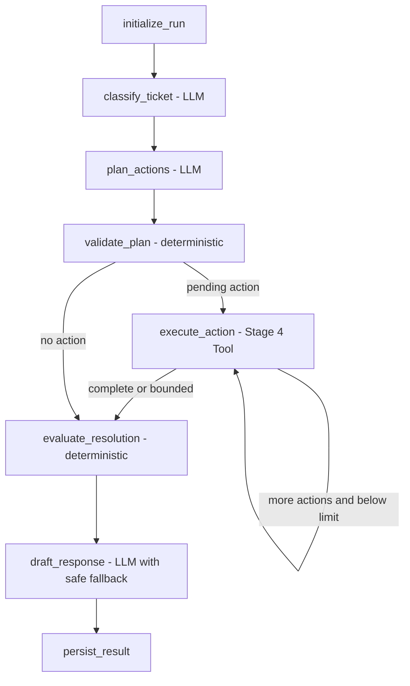

# Customer Support Ticket Agent

## Project Overview

Customer Support Ticket Agent is a staged portfolio project for a guarded LangGraph-based customer-support ticket system. Stage 5 implements a single-Agent stateful workflow over the deterministic business services, structured tools, and governed DemoShop policy corpus.

**DemoShop is a portfolio simulation.** Transactional records and policy reference materials come from different public sources and are not claimed to belong to the same real company. Olist supplies anonymized real transaction data; JD.com Help Center pages are paraphrased public-policy references; DemoShop workflow controls are simulated internal policies.

## Current and Planned Architecture

The Python application uses a `src` layout. Package boundaries separate Agent orchestration, thin tools, business services, persistence, future API delivery, and shared configuration/contracts.

```text
SQLite
  ↓
Business Services
  ↓
LangChain Structured Tools

Knowledge Markdown
  ↓
RAGFlow Retrieval API
  ↓
KnowledgeTool
```

The current tools retrieve customer/order context, list customer orders, evaluate refund candidates, manage synthetic tickets, and retrieve policy evidence. The Stage 5 graph uses structured LLM output for language understanding, bounded planning, and response wording, while deterministic nodes retain control of allowed actions, refund decisions, routing, ticket lifecycle, and persistence.



## Data Strategy

- Olist will be used as an anonymized real-world e-commerce transaction data source.
- Internal customer-support tickets, risk flags, refund approvals, and similar operational data will be explicitly labeled as **synthetic**.
- Knowledge policies will distinguish **public-policy-derived** material from **simulated internal policy** material.
- Raw source data and processed outputs will remain outside Git, while placeholder files preserve the intended directory layout.
- A fixed simulation clock (`2026-09-03T12:00:00`) and fixed seed make the Demo build reproducible.
- Scenario-aware selection retains 2,000 unique orders covering delivery, fulfillment-state, review, multi-item, and multi-payment cases.
- One offset per order normalizes every associated timestamp while preserving original intervals, late-delivery relationships, and flagged source chronology anomalies.
- Membership, risk, account status, identity verification, language, tickets, and refunds are synthetic operational data—not Olist facts.
- Public-policy-derived documents are paraphrased/adapted references and do not represent a real JD.com or Olist internal customer-service system.
- Simulated internal workflow thresholds have one machine-readable source of truth: `knowledge/business_rules.yaml`.
- Olist monetary values and the simulated automatic-refund threshold share the canonical `BRL` semantic; no currency conversion is applied.
- Refund frequency means prior `approved` refunds for the same customer in `[simulation_now - 30 days, simulation_now)`; the current request is excluded and a count of 2 or more requires escalation.

## Planned Tech Stack

- Python 3.10+
- FastAPI and Uvicorn
- LangChain and LangGraph
- SQLAlchemy and SQLite
- Pydantic
- httpx
- pytest
- Vue (planned frontend)

## Development Status

**Stage 5 — Guarded LangGraph workflow and real DeepSeek integration smoke completed.**

The Agent is built on these previously completed capabilities:

- typed `CustomerService`, `OrderService`, `TicketService`, and `RefundDecisionService`;
- a deterministic refund engine that separates policy eligibility from operational decision;
- six LangChain structured tools with one JSON-safe success/error envelope;
- RAGFlow v0.27.1 retrieval-only integration with local policy metadata normalization;
- real retrieval and disposable-database tool smoke suites.

Stage 5 adds:

- Pydantic-structured ticket classification, allowlisted action planning, and response drafting;
- a typed Agent state and compiled LangGraph with an eight-tool-call default bound;
- deterministic plan and resolution guardrails that an LLM cannot override;
- canonical ticket lifecycle transitions and sanitized `agent_runs` / `agent_steps` traces;
- a scripted LLM test adapter so normal tests have no API cost or network dependency;
- a limited real DeepSeek + RAGFlow integration script that refuses to run without complete local configuration.

The limited Stage 5 integration smoke completed 10/10 fixed cases with the configured DeepSeek model, Stage 4 tools, and RAGFlow. This is an integration check rather than a final quality benchmark.

`AUTO_RESOLVE` denotes a rule-qualified candidate only; no refund is executed. Knowledge retrieval returns evidence chunks and does not generate an answer.

Rebuild and verify Stage 2 from the project root:

```bash
env -u PYTHONPATH .venv/bin/python scripts/build_demo_dataset.py
env -u PYTHONPATH .venv/bin/python scripts/init_db.py
env -u PYTHONPATH .venv/bin/python scripts/run_smoke_queries.py
env -u PYTHONPATH .venv/bin/python scripts/audit_policies.py
env -u PYTHONPATH .venv/bin/python scripts/run_stage4_knowledge_smoke.py
env -u PYTHONPATH .venv/bin/python scripts/run_stage4_tool_smoke.py
env -u PYTHONPATH .venv/bin/python scripts/run_stage5_agent_smoke.py
env -u PYTHONPATH .venv/bin/python -m pytest -q
```

The retrieval scripts require a locally configured `.env` and an available, already-populated RAGFlow dataset. The Stage 5 real smoke additionally requires `DEEPSEEK_API_KEY`, `DEEPSEEK_BASE_URL`, and `DEEPSEEK_MODEL`. No API key is stored in the repository, persisted to runtime traces, or printed in reports.

Refunds are never executed: `AUTO_RESOLVE` remains a deterministic Demo decision candidate. There is no production authentication, FastAPI business interface, SSE, frontend, final evaluation benchmark, multi-agent workflow, or MCP integration.
