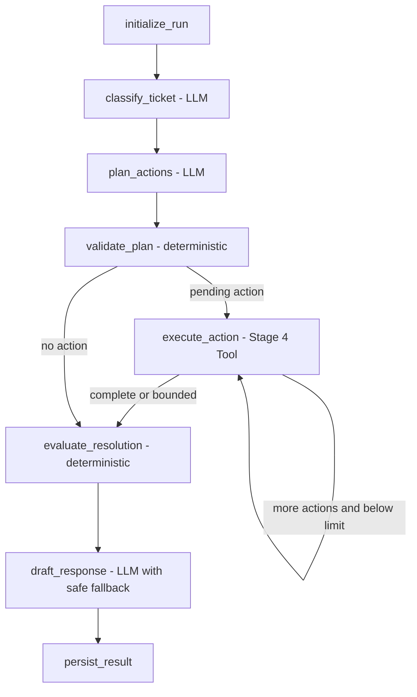

# Customer Support Ticket Agent

## Project Overview

Customer Support Ticket Agent is a staged portfolio project for a guarded LangGraph-based customer-support ticket system. Stage 7 adds a Vue 3 operations console on top of the Stage 6 typed FastAPI service, POST-based SSE streaming, human review operations, and dashboard metrics.

**DemoShop is a portfolio simulation.** Transactional records and policy reference materials come from different public sources and are not claimed to belong to the same real company. Olist supplies anonymized real transaction data; JD.com Help Center pages are paraphrased public-policy references; DemoShop workflow controls are simulated internal policies.

## Current and Planned Architecture

The Python application uses a `src` layout. Package boundaries separate Agent orchestration, thin tools, business services, persistence, future API delivery, and shared configuration/contracts.

```text
SQLite
  ↓
Business Services
  ↓
LangChain Structured Tools

Knowledge Markdown
  ↓
RAGFlow Retrieval API
  ↓
KnowledgeTool
```

The current tools retrieve customer/order context, list customer orders, evaluate refund candidates, manage synthetic tickets, and retrieve policy evidence. The Stage 5 graph uses structured LLM output for language understanding, bounded planning, and response wording, while deterministic nodes retain control of allowed actions, refund decisions, routing, ticket lifecycle, and persistence.



## Data Strategy

- Olist will be used as an anonymized real-world e-commerce transaction data source.
- Internal customer-support tickets, risk flags, refund approvals, and similar operational data will be explicitly labeled as **synthetic**.
- Knowledge policies will distinguish **public-policy-derived** material from **simulated internal policy** material.
- Raw source data and processed outputs will remain outside Git, while placeholder files preserve the intended directory layout.
- A fixed simulation clock (`2026-09-03T12:00:00`) and fixed seed make the Demo build reproducible.
- Scenario-aware selection retains 2,000 unique orders covering delivery, fulfillment-state, review, multi-item, and multi-payment cases.
- One offset per order normalizes every associated timestamp while preserving original intervals, late-delivery relationships, and flagged source chronology anomalies.
- Membership, risk, account status, identity verification, language, tickets, and refunds are synthetic operational data—not Olist facts.
- Public-policy-derived documents are paraphrased/adapted references and do not represent a real JD.com or Olist internal customer-service system.
- Simulated internal workflow thresholds have one machine-readable source of truth: `knowledge/business_rules.yaml`.
- Olist monetary values and the simulated automatic-refund threshold share the canonical `BRL` semantic; no currency conversion is applied.
- Refund frequency means prior `approved` refunds for the same customer in `[simulation_now - 30 days, simulation_now)`; the current request is excluded and a count of 2 or more requires escalation.

## Planned Tech Stack

- Python 3.10+
- FastAPI and Uvicorn
- LangChain and LangGraph
- SQLAlchemy and SQLite
- Pydantic
- httpx
- pytest
- Vue 3, TypeScript, Vite, Vue Router, and Ant Design Vue

## FastAPI Architecture

The HTTP layer follows one direction: thin router → application service → existing workflow/services → tools and persistence. Routers contain no SQL, refund rules, or copied LangGraph decisions. `create_app()` constructs dependencies without running an Agent, rebuilding data, calling DeepSeek, or calling RAGFlow. Startup only ensures the additive `human_reviews` history table exists.

Synchronous LangGraph, SQLite, LLM, and RAGFlow work runs in a bounded application thread pool. Async routes cooperatively await those futures so long work does not block the event loop. Both `/run` and `/run/stream` execute the same compiled graph; the stream adapter converts graph node updates into safe events.

Every JSON response uses a stable envelope:

```json
{"ok": true, "data": {}, "request_id": "client-or-server-request-id"}
```

Errors use a non-200 HTTP status and `{ "ok": false, "error": { "code": "...", "message": "..." }, "request_id": "..." }`. Clients may supply `X-Request-ID`; every response echoes it in the header and body. Logs contain request ID, method, path, status, and latency, but not request bodies, authorization headers, secrets, or complete prompts.

## API Endpoints

- `GET /health` — lightweight liveness and version.
- `GET /ready` — SQLite availability plus configuration presence; it never invokes generation or retrieval.
- `GET /api/v1/tickets` — paginated tickets, optionally filtered by `status`, `decision`, or `intent`.
- `POST /api/v1/tickets` — create a linked synthetic demo ticket without running the Agent.
- `GET /api/v1/tickets/{ticket_id}` — ticket, safe customer/order summary, and latest run summary.
- `POST /api/v1/agent/run` — synchronous-response Agent execution.
- `POST /api/v1/agent/run/stream` — SSE Agent execution.
- `GET /api/v1/agent-runs/{run_id}` — safe run summary.
- `GET /api/v1/agent-runs/{run_id}/steps` — ordered sanitized timeline.
- `GET /api/v1/human-reviews` — paginated canonical escalation queue.
- `POST /api/v1/human-reviews/{ticket_id}` — controlled `RESOLVE`, `REQUEST_MORE_INFO`, or `KEEP_ESCALATED` review action.
- `GET /api/v1/dashboard/summary` — live SQLite ticket/run counts, average latency, and recent runs.

List endpoints default to 20 records and cap `page_size` at 100. The API input for an Agent run is `message` plus optional `customer_id`, `order_id`, and `ticket_id`. An existing `ticket_id` is processed directly. Without a ticket, valid customer and order IDs cause a linked demo ticket to be created; incomplete context remains an unlinked run with `ticket_id: null`, allowing a truthful `NEED_MORE_INFO` result. `POST /tickets` requires both valid links because the existing operational Ticket schema intentionally enforces those foreign keys.

Example:

```bash
curl -sS http://127.0.0.1:8000/health -H 'X-Request-ID: local-example'

curl -sS http://127.0.0.1:8000/api/v1/agent/run \
  -H 'Content-Type: application/json' \
  -d '{"message":"My package is late, but I cannot find the order ID."}'
```

## SSE Usage

The stream sequence is `run_started`, `classification`, zero or more `tool_started` / `tool_completed` pairs, `decision`, `final_response`, and `run_completed`. Safe failures emit `error` and terminate. Each event carries JSON with a timestamp and run ID once available; full prompts, policy bodies, credentials, and raw trace payloads are excluded.

Because browsers' native `EventSource` cannot POST, Stage 7 must consume this endpoint with `fetch()` and `ReadableStream`:

```bash
curl -N http://127.0.0.1:8000/api/v1/agent/run/stream \
  -H 'Content-Type: application/json' \
  -d '{"message":"My package is late, but I cannot find the order ID."}'
```

## Human Review and Dashboard

The review queue is derived from canonical `ESCALATE_TO_HUMAN` runs and `under_review` tickets, never from response text. Reviewer actions update only the synthetic demo lifecycle and append metadata to `human_reviews`. They do not call a payment provider or represent money as refunded. Dashboard values are queried from the current runtime SQLite database; Stage 5 smoke numbers are never hard-coded.

## Frontend Operations Console

The Stage 7 browser application is a desktop-focused operations console. Its pages are:

- `/` — live dashboard totals, decision/status distributions, and recent Agent runs;
- `/tickets` — paginated Ticket inbox with status, decision, and intent filters;
- `/tickets/:ticketId` — Ticket context, latest safe Agent outcome, and sanitized trace;
- `/human-reviews` — canonical escalation queue with controlled review actions;
- `/demo` — real POST-SSE Agent execution with a live timeline and verified anonymous demo identifiers.

Frontend code is separated into typed API modules, reusable presentation components, route-level pages, and an SSE composable. The browser calls only FastAPI; DeepSeek and RAGFlow credentials remain server-side.

```text
Vue operations console
  ↓ HTTP JSON / POST SSE
FastAPI
  ↓
LangGraph
  ↓
Business Tools → SQLite / RAGFlow
```

The interface deliberately labels `AUTO_RESOLVE` as a candidate rather than a completed refund. Human review is a simulated workflow and no financial action is executed.

## Development Run

```bash
env -u PYTHONPATH .venv/bin/python -m uvicorn customer_support_agent.api.main:app \
  --app-dir src --host 127.0.0.1 --port 8000
```

In development, interactive docs are available at `/docs` and the typed specification at `/openapi.json`. CORS uses the `CORS_ALLOWED_ORIGINS` comma-separated allowlist (default `http://localhost:5173`), never `*`; credentials are disabled.

Run the frontend in a second terminal:

```bash
cd frontend
npm ci
npm run dev
```

Then open [http://localhost:5173](http://localhost:5173). For a first-time local setup, `npm install` also works; `package-lock.json` is committed so subsequent installs should prefer `npm ci`.

## Development Status

**Stage 7 — Vue 3 customer-support operations console implemented and visually accepted.**

The Agent is built on these previously completed capabilities:

- typed `CustomerService`, `OrderService`, `TicketService`, and `RefundDecisionService`;
- a deterministic refund engine that separates policy eligibility from operational decision;
- six LangChain structured tools with one JSON-safe success/error envelope;
- RAGFlow v0.27.1 retrieval-only integration with local policy metadata normalization;
- real retrieval and disposable-database tool smoke suites.

Stage 5 adds:

- Pydantic-structured ticket classification, allowlisted action planning, and response drafting;
- a typed Agent state and compiled LangGraph with an eight-tool-call default bound;
- deterministic plan and resolution guardrails that an LLM cannot override;
- canonical ticket lifecycle transitions and sanitized `agent_runs` / `agent_steps` traces;
- a scripted LLM test adapter so normal tests have no API cost or network dependency;
- a limited real DeepSeek + RAGFlow integration script that refuses to run without complete local configuration.

Stage 6 adds:

- typed success/error envelopes and normalized domain/validation/service failures;
- request correlation, safe request logging, explicit CORS, liveness, and readiness;
- paginated Ticket and review APIs plus safe Agent run/timeline queries;
- one shared LangGraph execution path for non-streaming and SSE delivery;
- append-only human review history and runtime-derived dashboard metrics;
- fake-model API/SSE tests plus a bounded real localhost HTTP integration smoke.

Stage 7 adds:

- a professional Ant Design Vue layout for Dashboard, Tickets, Human Review, and Agent Demo;
- one typed FastAPI client with consistent envelope, request-ID, timeout, and network-error handling;
- a POST-SSE `fetch()` / `ReadableStream` client that tolerates unknown future event types;
- sanitized ordered Agent timelines and safe routing/outcome language;
- focused Vitest coverage for API envelopes, page states, lists, actions, tags, traces, SSE parsing, and form validation;
- reproducible Node dependencies through `package-lock.json` and a Vite production build.

The limited Stage 5 integration smoke completed 10/10 fixed cases with the configured DeepSeek model, Stage 4 tools, and RAGFlow. This is an integration check rather than a final quality benchmark.

`AUTO_RESOLVE` denotes a rule-qualified candidate only; no refund is executed. Knowledge retrieval returns evidence chunks and does not generate an answer.

Rebuild and verify Stage 2 from the project root:

```bash
env -u PYTHONPATH .venv/bin/python scripts/build_demo_dataset.py
env -u PYTHONPATH .venv/bin/python scripts/init_db.py
env -u PYTHONPATH .venv/bin/python scripts/run_smoke_queries.py
env -u PYTHONPATH .venv/bin/python scripts/audit_policies.py
env -u PYTHONPATH .venv/bin/python scripts/run_stage4_knowledge_smoke.py
env -u PYTHONPATH .venv/bin/python scripts/run_stage4_tool_smoke.py
env -u PYTHONPATH .venv/bin/python scripts/run_stage5_agent_smoke.py
env -u PYTHONPATH .venv/bin/python scripts/run_stage6_api_smoke.py
env -u PYTHONPATH .venv/bin/python -m pytest -q
```

The retrieval scripts require a locally configured `.env` and an available, already-populated RAGFlow dataset. The Stage 5 real smoke additionally requires `DEEPSEEK_API_KEY`, `DEEPSEEK_BASE_URL`, and `DEEPSEEK_MODEL`. No API key is stored in the repository, persisted to runtime traces, or printed in reports.

Refunds are never executed: `AUTO_RESOLVE` remains a deterministic Demo decision candidate. Stage 7 is localhost/development software with no production authentication; the internal review endpoints are not safe for public deployment. There is no final evaluation benchmark, Docker Compose integration, multi-agent workflow, MCP integration, task queue, or WebSocket service. The current frontend targets desktop use; its Stage 7 manual visual acceptance is complete.
